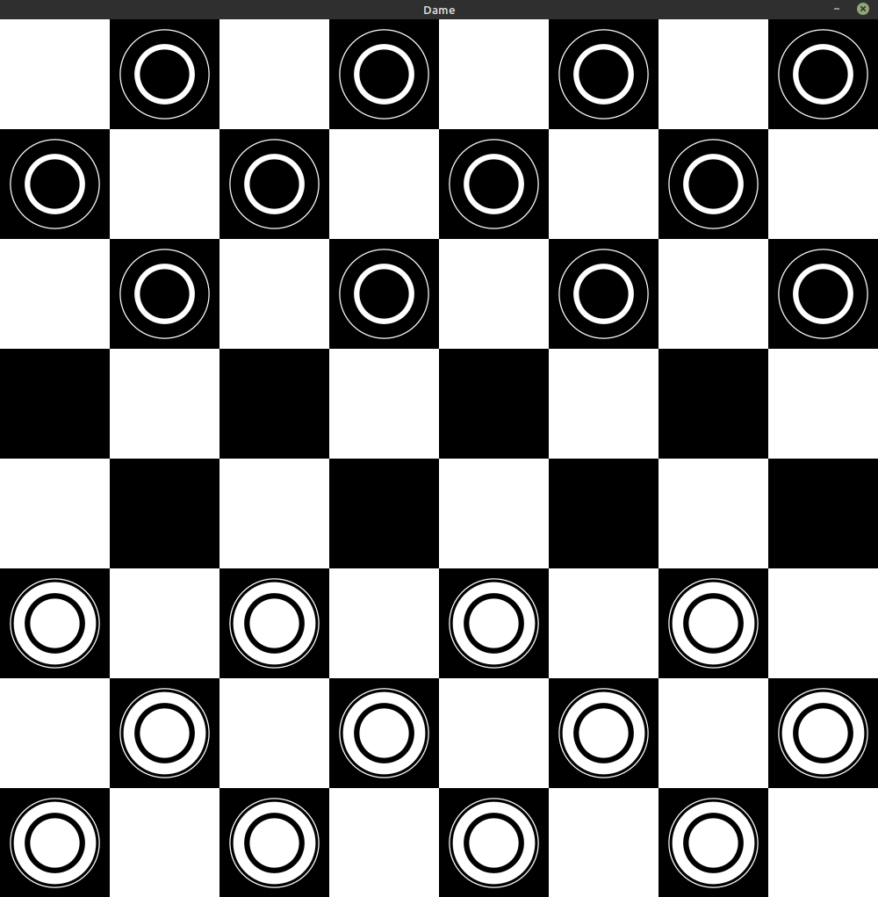

# Dame
A Clojure implementation of Dame, a german checker game.
Requirement: OpenJdk 11 or higher
(windows: https://docs.microsoft.com/en-gb/java/openjdk/download
Linux: https://adoptopenjdk.net/releases.html chose Hotspot Jvm)

## New
Now playable vs Computer (easy)

## How to play
It is played on a 8x8 black and white grid, with the lowest left square being black.
Each player starts with 3 rows of stones on their side. Player 1 with white stones, Player 2 with black stones.

Player 1 (white) starts first. One stone can be moved within a turn. A stone can only be moved 1 step diagonally forward, if no opponent stone
lies in the way. If a opponent stone is in the way diagonally, then you can jump diagonally over it (2 steps) and remove the opponent stone.
This can be repeated within the same turn. Even a zig-zag course is allowed.
If one player's stone reaches the other side of the board, then the stone gets upgraded with the same coloured stone on top of it (it becomes a "Dame").
A "Dame" can move freely diagonal, like a Bishop in chess.
A player wins, if the opponent is unable to make a move (all stones are gone or blocked).

